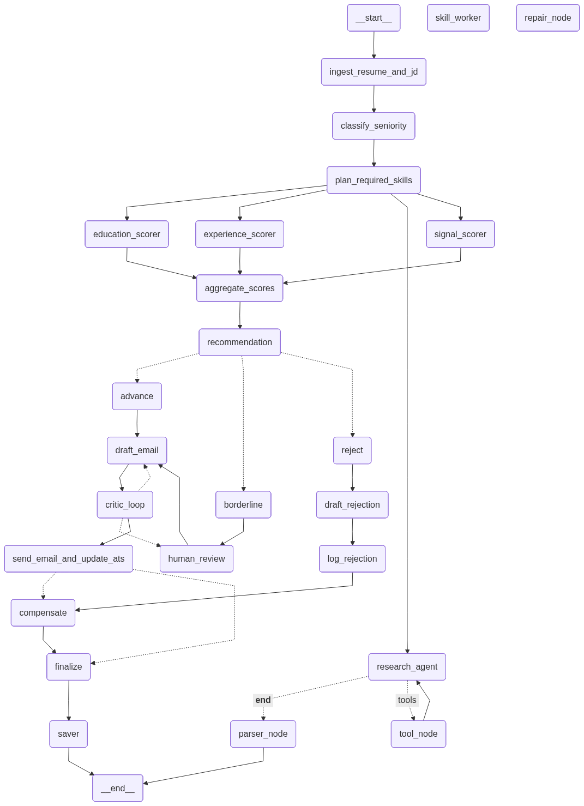

# HireGraph — LangGraph Smart Hiring Assistant

HireGraph is a LangGraph-powered hiring assistant that:

---
## Repository

GitHub Repo:
https://github.com/arkmr33/hire_graph

---


* Reads resumes and job descriptions
* Classifies candidate seniority
* Scores candidates across multiple dimensions
* Generates explainable hiring recommendations
* Drafts personalized emails
* Supports human-in-the-loop review
* Implements retries, recovery loops, saga compensation, and orchestration patterns

---

# Project Structure

```text
hiregraph/
│
├── README.md
├── requirements.txt
├── .env.example
├── main.py
│
├── graph_out/
│   └── graph.png
│
├── sample_data/
│   ├── jds/
│   │   ├── jd_senior_backend.md
│   │   └── jd_junior_data.md
│   │
│   ├── resumes/
│   │   ├── resume_priya.md
│   │   ├── resume_eitan.md
│   │   └── resume_mira.md
│   │
│   └── expected_outcomes.md
│
├── api/
│   └── server.py
│
├── ui/
│   └── app.py
│
├── notebooks/
│   └── walkthrough.ipynb
│
├── tests/
│   ├── test_state.py
│   ├── test_nodes.py
│   └── test_e2e.py
│
└── src/
    └── hiregraph/
        │
        ├── graph.py
        ├── state.py
        ├── llm.py
        ├── schemas.py
        │
        ├── prompts/
        │   ├── classify.txt
        │   ├── scoring.txt
        │   ├── email.txt
        │   └── critique.txt
        │
        ├── nodes/
        │   ├── ingest.py
        │   ├── classify.py
        │   ├── planning.py
        │   ├── orchestrator.py
        │   ├── skill_worker.py
        │   ├── scoring.py
        │   ├── research_agent.py
        │   ├── decision.py
        │   ├── human_review.py
        │   ├── email.py
        │   ├── rejection.py
        │   ├── retry_nodes.py
        │   ├── compensation.py
        │   ├── recovery.py
        │   └── finalize.py
        │
        ├── tools/
            ├── tavily_search.py
            └── github_lookup.py
        
      

---

# Workflow

```text
Resume + Job Description
            ↓
         Ingest
            ↓
   Classify Seniority
            ↓
    Plan Required Skills
            ↓
 ORCHESTRATE Workers (Send)
            ↓
 Parallel Scorers
(experience, education,
 signal, research)
            ↓
     Aggregate Scores
            ↓
 Recommendation
(advance / reject / borderline)
            ↓
If borderline → Human Review
        using interrupt()
            ↓
       Draft Email
            ↓
   Critic / Retry Loop
      (up to 3 retries)
            ↓
  Send Email + Update ATS
            ↓
          Finalize
```

---

# Features

* LangGraph orchestration
* TypedDict-based state management
* Structured LLM outputs
* Parallel scoring pipelines
* Orchestrator-worker pattern
* Evaluator-optimizer loops
* Tool calling
* Retry and recovery policies
* Human approval using `interrupt()`
* Saga compensation handling
* Graph visualization support

---

# Setup


## Sample Hire Reports

Generated candidate evaluation reports are stored in:

```text
hire_reports/
```

---

## Create virtual environment

```bash
uv venv
source .venv/bin/activate
```

## Install dependencies

```bash
uv pip install -r requirements.txt
```

## Configure environment variables

Create a `.env` file:

```env
OPENAI_API_KEY=your_key
TAVILY_API_KEY=your_key
HIREGRAPH_USE_MOCKS=true
```

---

# Run end to end tests

```bash
python -m tests.test_e2e
```

---


---

# Run the Application

```bash
python main.py
```

---

# Architecture

Graph visualization:



---

# Implemented LangGraph Patterns

| Pattern                     | Status |
| --------------------------- | ------ |
| TypedDict State             | ✅      |
| Command Routing             | ✅      |
| RetryPolicy                 | ✅      |
| LLM Recovery Loop           | ✅      |
| `interrupt()` Human Review  | ✅      |
| Saga Compensation           | ✅      |
| Structured Output           | ✅      |
| Tool Calling                | ✅      |
| Parallelization             | ✅      |
| Orchestrator-Worker Pattern | ✅      |
| Evaluator-Optimizer Loop    | ✅      |

---

# Future Improvements

* Add persistent checkpointing
* Add streaming token support
* Add recruiter dashboard
* Integrate vector memory
* Add multi-agent interview simulation
* Add observability with LangSmith
* Add Docker deployment support
